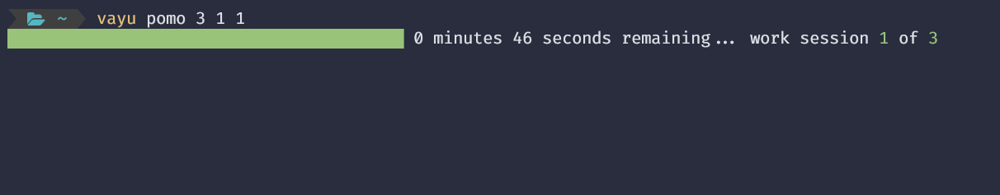

# Description
Vayu is a productivity supercharger for engineers. The end goal for the tool is to have a multipurpose tool with various tools such as task and note storage, task management, and a pomodoro study timer. As a computer engineering student at UIUC, having an organized optimized system is critical. I hope to bring that to others with vayu.
# Demo Images

# Installation
The best way to install vayu is via cargo which comes with an installation of rust. For installation of rust navigate to https://www.rust-lang.org/tools/install.

Then in Windows PowerShell or the approriate Terminal for your OS type in:
`cargo install vayu`

To check if vayu has been installed properly open a new terminal window and type:
`vayu list`

If there is an empty list then congratulations the installation was successful! If not ensure rust is included in your path variable as explained on the rust installation page.
# Usage and Examples

### to view a list of current tasks use:
`vayu list`

### to add a task with natural language:
`vayu auto "task description (some description of date)"`

### to mark tasks as done:
`vayu done id`
where id is the listed id of the task viewable through `vayu list`

### to use the pomodoro timer:
`vayu pomo iterations work_session_time break_session_time`

### grab the latest in tech from y-combinator's hacker news
`vayu news`

# Deprecated Features
The following tools have better alternatives on the market currently and have hence are in a legacy state.
* Event Planner
* Main Dashboard

# Contributions
vayu wouldn't be possible without several great rust crates. For a full list of dependencies please checkout the `Cargo.toml` file. 
